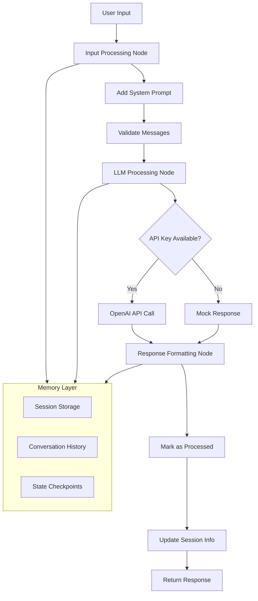

# Simple Chatbot with OpenAI Integration

A modular, production-ready chatbot built with LangGraph and OpenAI integration. This chatbot features a clean architecture with separated concerns, making it easy to maintain, extend, and test.

## 🏗️ Architecture Overview

The chatbot is built using a modular architecture with the following components:

```
app/agents/
├── states/          # State definitions and data models
├── nodes/           # Processing nodes for the workflow
├── graph/           # LangGraph workflow builder
├── utils/           # Utility functions
└── chat_agent.py    # Main orchestrator class
```

### Key Features

- **Modular Design**: Separated concerns for easy maintenance and testing
- **LangGraph Integration**: Workflow orchestration with state management
- **OpenAI Integration**: GPT-4 powered responses with fallback for missing API keys
- **Session Management**: Persistent conversation history and user context
- **User Types**: Specialized responses for different user types (customer, support_agent, manager)
- **Error Handling**: Graceful error handling with user-friendly messages
- **Memory Management**: Conversation history persistence across sessions

## 🚀 Quick Start

### Prerequisites

- Python 3.8+
- OpenAI API Key (optional - will use mock responses if not provided)

### Installation

1. **Clone the repository**
   ```bash
   git clone <repository-url>
   cd chatbot-boilerplate
   ```

2. **Create virtual environment**
   ```bash
   python -m venv .venv
   source .venv/bin/activate  # On Windows: .venv\Scripts\activate
   ```

3. **Install dependencies**
   ```bash
   pip install -r requirements.txt
   ```

4. **Set up environment variables**
   ```bash
   cp env.example .env
   # Edit .env and add your OPENAI_API_KEY
   ```

### Basic Usage

```python
from app.agents.chat_agent import ChatAgent

# Initialize the chat agent
agent = ChatAgent()
await agent.initialize()

# Start chatting
response = await agent.chat(
    message="Hello, how can you help me?",
    session_id="user_123",
    user_type="customer"
)
print(response)
```

## 📋 Detailed Documentation

### Components Overview

#### 1. States (`app/agents/states/`)

**`ChatState`** - The main state object that flows through the workflow:
- `messages`: Conversation history with automatic message addition
- `session_id`: Unique identifier for the conversation session
- `user_type`: Type of user (customer, support_agent, manager)
- `processed`: Flag indicating if the state has been fully processed

**`SessionInfo`** - Session metadata and tracking:
- `session_id`: Session identifier
- `message_count`: Number of messages in the session
- `user_type`: User type classification

#### 2. Nodes (`app/agents/nodes/`)

**`ChatNodes`** - Container for all processing nodes:

- **`input_processing_node`**: Prepares user input and adds system context
  - Adds appropriate system prompts based on user type
  - Ensures system message is present in conversation

- **`llm_processing_node`**: Handles OpenAI API integration
  - Makes calls to OpenAI GPT models
  - Provides fallback mock responses when API key is missing
  - Handles errors gracefully with user-friendly messages

- **`response_formatting_node`**: Finalizes the response
  - Marks the state as processed
  - Updates session information and message counts

#### 3. Graph (`app/agents/graph/`)

**`ChatGraphBuilder`** - Constructs the LangGraph workflow:
- Defines the processing pipeline: Input → LLM → Response
- Sets up edges and transitions between nodes
- Configures memory checkpointing for conversation persistence

#### 4. Utils (`app/agents/utils/`)

**`get_system_prompt`** - Returns specialized system prompts:
- **Customer**: Friendly, helpful assistant
- **Support Agent**: Detailed, accurate information provider
- **Manager**: Strategic insights and data-driven recommendations

### Workflow Diagram



## 🔧 Configuration

### Environment Variables

Create a `.env` file with the following variables:

```env
# OpenAI Configuration
OPENAI_API_KEY=your_openai_api_key_here

# Model Configuration (Optional)
OPENAI_MODEL=gpt-4o-mini
OPENAI_TEMPERATURE=0.7
OPENAI_MAX_TOKENS=1000

# Logging Configuration (Optional)
LOG_LEVEL=INFO
```

### User Types

The chatbot supports three user types with specialized behaviors:

| User Type | System Prompt | Use Case |
|-----------|---------------|----------|
| `customer` | Friendly, helpful assistant | End-user support |
| `support_agent` | Detailed, accurate information | Internal support team |
| `manager` | Strategic insights and recommendations | Management and analytics |

## 📖 API Reference

### ChatAgent Class

#### Methods

**`async initialize()`**
- Initializes the chat agent with LLM and graph setup
- Must be called before using other methods

**`async chat(message: str, session_id: str = "default", user_type: str = "customer") -> str`**
- Main chat interface
- Returns AI response to user message
- Maintains conversation context within session

**`async get_conversation_history(session_id: str) -> List[Dict[str, Any]]`**
- Retrieves conversation history for a session
- Returns list of messages with metadata

**`async clear_session(session_id: str)`**
- Clears conversation history for a session
- Removes session from memory

**`async session_exists(session_id: str) -> bool`**
- Checks if a session exists in memory

**`async get_session_info(session_id: str) -> Optional[SessionInfo]`**
- Retrieves session metadata and statistics

## 🧪 Testing

### Running Tests

```bash
# Run all tests
python -m pytest tests/

# Run with coverage
python -m pytest tests/ --cov=app

# Run specific test file
python -m pytest tests/test_chat_agent.py
```

### Manual Testing

```python
# Test basic functionality
from app.agents.chat_agent import ChatAgent

agent = ChatAgent()
await agent.initialize()

# Test different user types
customer_response = await agent.chat("Help me with my order", "session1", "customer")
agent_response = await agent.chat("What's the refund policy?", "session2", "support_agent")
manager_response = await agent.chat("Show me user metrics", "session3", "manager")
```

## 🔍 Monitoring and Logging

The application uses Python's built-in logging module:

```python
import logging

# Configure logging
logging.basicConfig(level=logging.INFO)
logger = logging.getLogger(__name__)
```

Key log events:
- Session initialization and management
- LLM processing and errors
- Graph workflow progression
- API call successes and failures

## 🚀 Deployment

### Docker Deployment

```dockerfile
FROM python:3.11-slim

WORKDIR /app
COPY requirements.txt .
RUN pip install -r requirements.txt

COPY . .
CMD ["python", "-m", "app.main"]
```

### Environment Setup

```bash
# Production deployment
docker build -t chatbot .
docker run -e OPENAI_API_KEY=your_key chatbot
```

## 🤝 Contributing

1. Fork the repository
2. Create a feature branch (`git checkout -b feature/amazing-feature`)
3. Make your changes following the modular architecture
4. Add tests for new functionality
5. Commit your changes (`git commit -m 'Add amazing feature'`)
6. Push to the branch (`git push origin feature/amazing-feature`)
7. Open a Pull Request

## 📝 License

This project is licensed under the MIT License - see the [LICENSE](LICENSE) file for details.

## 🆘 Support

For support and questions:
- Create an issue in the GitHub repository
- Check the documentation and examples
- Review the test cases for usage patterns

## 🗺️ Roadmap

- [ ] Add support for more LLM providers (Anthropic, Google, etc.)
- [ ] Implement advanced conversation features (context summarization)
- [ ] Add metrics and analytics dashboard
- [ ] Support for custom tools and function calling
- [ ] Integration with vector databases for RAG capabilities
- [ ] Multi-language support
- [ ] Advanced session management with database persistence 